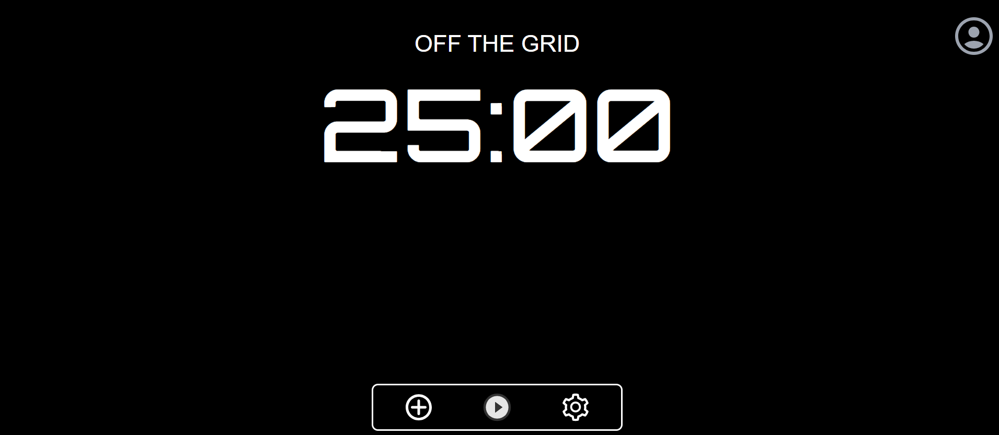

# OFF THE GRID:

The Off the Grid project is a website designed to help people improve their focus and productivity using the Pomodoro Technique and to-do lists.
Off the Grid is aimed at anyone who wants to improve their focus and get more done. This includes students, professionals, and anyone who feels overwhelmed by tasks.
On the front end, I opted for React.js in conjunction with Tailwind CSS. React's component-based structure allows for building reusable UI elements and managing complex interactions, which is ideal for a dynamic to-do list and timer functionality. Tailwind CSS provides pre-built utility classes, streamlining the styling process and ensuring a clean, consistent look across the website. This combination allows me to focus on core functionality without getting bogged down in custom CSS.

For the backend, I chose Flask, a lightweight Python web framework. Flask offers a good balance between flexibility and ease of use, perfect for this project's scale. It allows me to handle user interactions, manage data persistence, and integrate with the database.

Finally, I selected PostgreSQL as the database solution. PostgreSQL is a powerful and reliable open-source database that can efficiently store and manage the to-do list entries, user information, and potentially other project data as it grows in features.

## features
- Customizable Pomodoro Timertodo list
- Functional To-Do List
- Inspirational Quote
[vist the website](https://off-the-grid-frontend.onrender.com/)

Temesgen demeke 
[X](https://twitter.com/temesgendora)
[linkedin](https://www.linkedin.com/in/temesgen-demeke)

## Contribute

Contributions are always welcome!

## License

